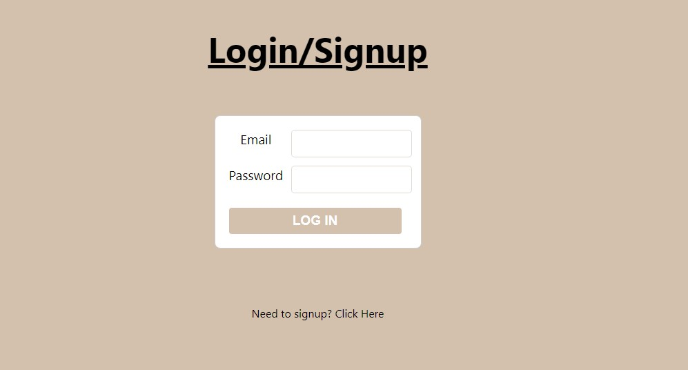
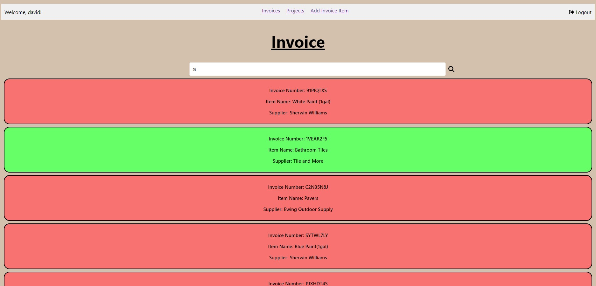
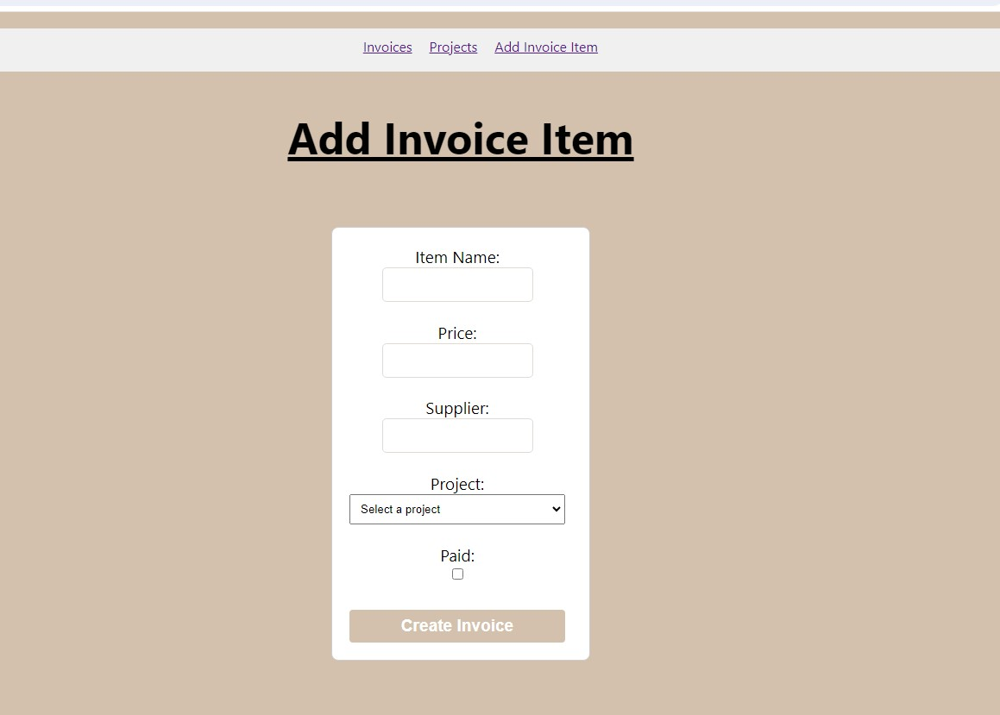

# HandyBillz

This is a very straightforward application with tons of practicality for many small business owners! This is a very simple, yet effective way for people to be able to track what Projects they have coming up at work and also be able to manage if customers have paid all existing portions of their bill! Unfortunately many small business owners are not able to afford spending tons of money getting amazing invoicing systems, and for them, this is the solution! Owners will be setup with an Admin account and they will have the ability to create more admin accounts if they so require, as Admin accounts are the only ones able to create new "Projects" for items to be billed to in the system. They can get the rest of their team setup as "User" accounts which will be able to create new invoice items and add them to existing projects!

Heres a quick Preview of HandyBillz!

##  Technologies Used: 

-Express.Js
-React
-Node.js
-Mongoose
-JWT
-MongoDB

##  Getting Started: 

If this sounds like something that could be of use to you, Try it out and we can get a customized version for your needs up and running in no time!
[Lets go!](http://localhost:3000/invoices/new)

###  Next steps:

 There are still a ton of new feature quickly coming to this application!

Next Features to be implemented:
 - Create an archive page and system for all completed projects to be taken off the Projects page and sent to the Archives, so you will never lose that information!
 - Setup alert system for the system to send out notifications to your email if there is an ongoing project with unpaid invoice items 7, 4, and 1 day before project due date.
 - Create a system for "User" accounts to submit a request for a new project to be created, and the Admin account will be able to approve/deny the new project creation.
 - Constant visual upgrades to the interface.